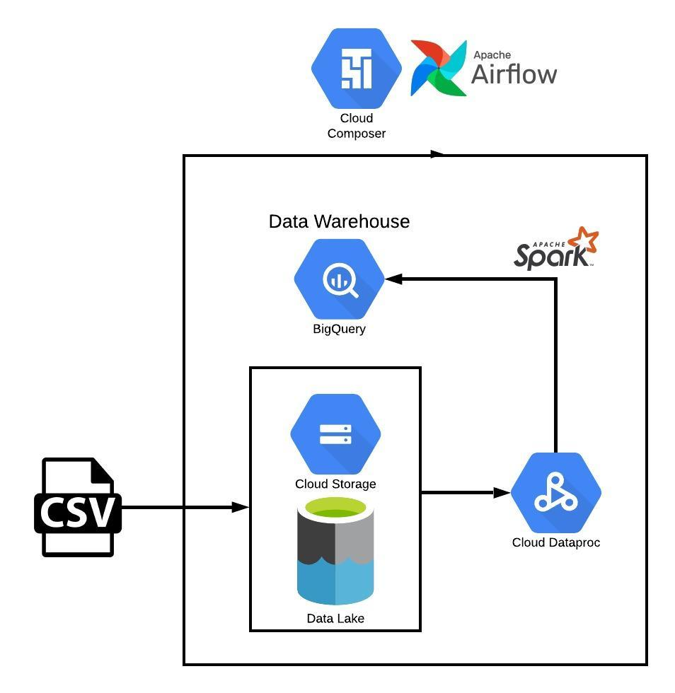

# Flights-GCP-ETL

           
----

Airlines help people to move around the world but How many people use the plane as a means of transportation?.
In 2018, 120,000 daily flights were registered on , according to the latest report "Aviation: Benefits Beyond Borders" this is around 12 million passengers in one single day, there is not doubt that this is a lot of data to manage.

The task
----

The objective of this project is proces this flights data obtained from Kaggle in the cloud to storage a daily basis DataWarehouse

Tools that were used to accomplish this task:

- Python
- SQL
- Spark
- BigQuery
- Google Workflow
- Apache Airflow
- Linux

        

Data
----
The schema of the data is as follows:

    [ 
      {
        "mode": "REQUIRED",
        "name": "avg_departure_delay",
        "type": "FLOAT"
      },
      {
        "mode": "REQUIRED",
        "name": "avg_arrival_delay",
        "type": "FLOAT"
      },
      {
        "mode": "REQUIRED",
        "name": "flight_num",
        "type": "INTEGER"
      },
      {
        "mode": "REQUIRED",
        "name": "flight_date",
        "type": "DATE"
      }
    ]

Process
----

The procedure that was taken to process the information is as follows:

- Apply transformation to flight dealys data using Spark-SQL
- Save the transformed data into Big Query partitioned tables
- Use Google Workflow templates to automate the Spark ETL batch processing job
- Use Apache Airflow to create DAGs and automate the batch processing job

The folder 'Manual Job' have all the scripts step by step in individual batch files that run all process manually.
The folder 'Workflow' automates all the process using an unique batch file that runs all the commands excluding the creation of the tables in Big Query. To run it you should trigger the file manually.
The folder 'Airflow' brings a python file that automates all the proccess, the advange of this script is that is triggers alone everyday at 2:30 pm.

Architecture
----

Here is the GCP architecture, this shows the resources that are used

     